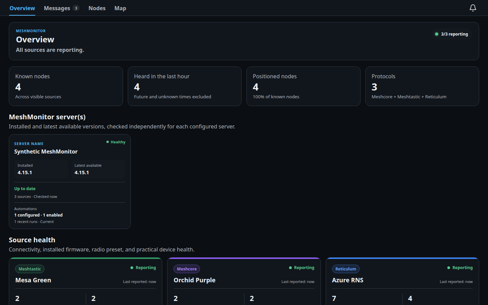
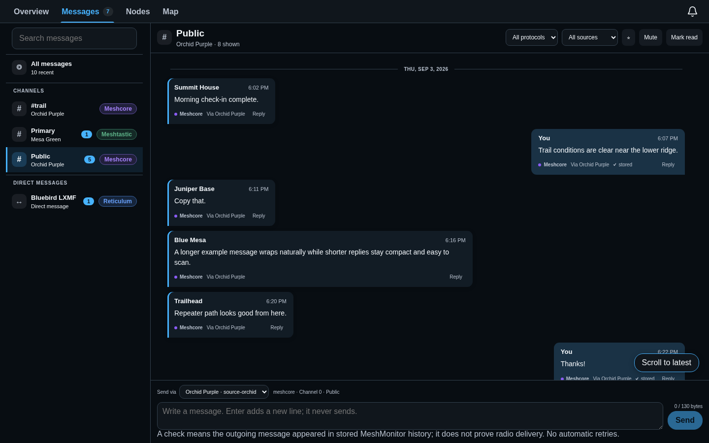
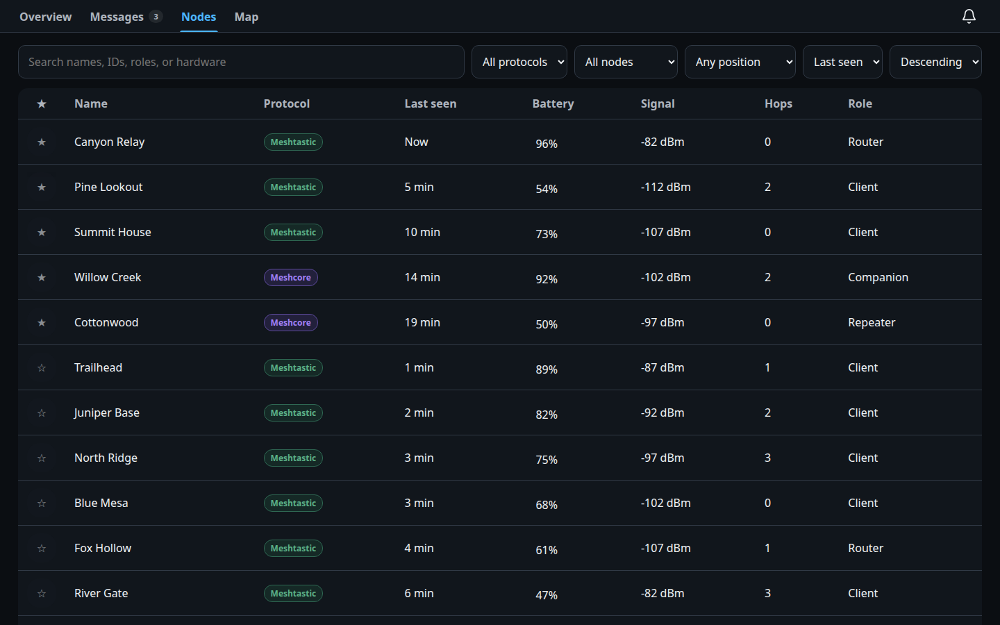
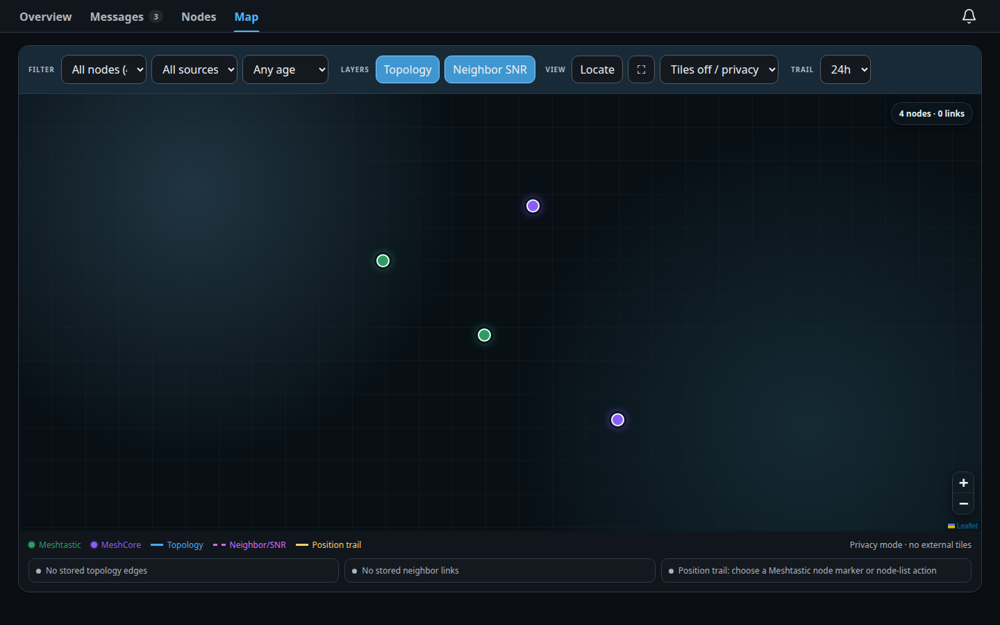
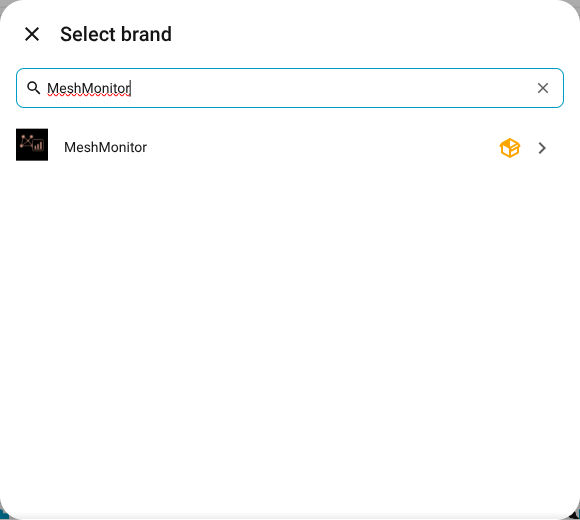
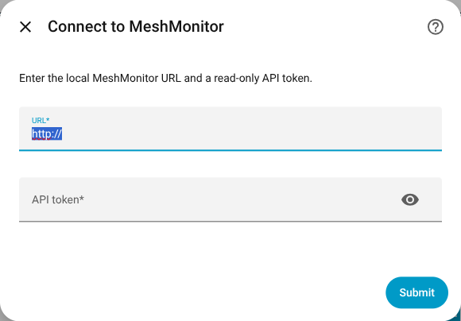

# MeshMonitor for Home Assistant

See your Meshtastic, MeshCore, and Reticulum networks from Home Assistant.
MeshMonitor adds a sidebar panel for checking source health, browsing nodes,
viewing positions, reading conversations, and building Home Assistant
automations from mesh activity.

MeshMonitor still handles radio setup, channels, credentials, firmware, and
server administration. This integration is meant to make day-to-day monitoring
easy.

> [!IMPORTANT]
> Version 0.16.0 is still being prepared for its first release. The source is
> public, but there is not yet a supported HACS release or Python package. If
> you are testing the current source, back up Home Assistant first.

## Highlights

- One Home Assistant panel for Meshtastic, MeshCore, and Reticulum.
- A clear overview of connected sources, active nodes, positions, and recent
  activity.
- Searchable node and conversation views.
- A combined map with Standard, Neutral Dark, and tile-free privacy styles.
- Home Assistant devices, sensors, and optional GPS trackers.
- Events, device triggers, actions, and ready-to-import automation blueprints.
- Optional favorites and message sending, disabled until you turn them on.

Reticulum support includes source status, interface and destination details,
positioned destinations on the map, LXMF history and events, and optional
direct messaging. Sending stays off until you enable it for that exact source
and grant `messages:write` to the MeshMonitor API user.

## Screenshots

The data in these screenshots is fictional. The images use the real
MeshMonitor panel without exposing a live network. See the
[screenshot notes](docs/images/README.md) for details.

## What you need

- Home Assistant 2026.8.0 or newer.
- A MeshMonitor 4.14.x or 4.15.x server that Home Assistant can reach.
- At least one Meshtastic, MeshCore, or Reticulum source in MeshMonitor.
- A dedicated MeshMonitor API user and token.

Start with a read-only API user. Add write permissions only if you decide to
enable an optional feature such as favorites or message sending.

## Installation

### HACS

HACS installation will be the recommended method after the first tagged
release:

1. In HACS, open the menu and choose **Custom repositories**.
2. Add this repository as an **Integration**.
3. Find **MeshMonitor** in HACS and choose **Download**.
4. Restart Home Assistant.
5. Continue with [Add the integration](#add-the-integration).

There is no supported tagged release yet. These steps are included so the
first release can be tested before it is announced.

### Manual testing

1. Download or clone this repository.
2. Copy the complete `custom_components/meshmonitor` folder to
   `/config/custom_components/meshmonitor` in Home Assistant.
3. Restart Home Assistant.
4. Go to **Settings → Devices & services → Add integration** and search for
   **MeshMonitor**.

Copy the whole folder. It must include the `frontend`, `translations`, and
`vendor_meshmonitor_client` folders.

## Add the integration

### 1. Create a MeshMonitor API user

In MeshMonitor, create a separate API user for Home Assistant. Give it access
only to the sources and channels you want Home Assistant to see.

For basic monitoring, grant:

- source and channel visibility;
- `nodes:read`; and
- `info:read`.

Add `messages:read` if you want conversations and message events.

### 2. Add MeshMonitor in Home Assistant

1. Open **Settings → Devices & services**.
2. Choose **Add integration**.
3. Search for **MeshMonitor**.

4. Enter the MeshMonitor address that Home Assistant can reach.
5. Paste the API token.
6. Review the sources found by the setup screen and finish setup.

Use the main MeshMonitor address, such as `https://mesh.example.com`. Do not add
an API path, username, password, or token to the URL.

### 3. Review the options

Open the MeshMonitor integration and choose **Configure**. Settings are grouped
into server-wide options and options for each source.

Start with **Server settings** to choose whether the sidebar panel and
automation monitoring are enabled.

The defaults are suitable for read-only monitoring:

| Setting | Default | What it does |
| --- | --- | --- |
| Node and telemetry polling | 60 seconds | Updates source and node information. |
| GPS trackers | On | Adds trackers for nodes that report a current position. |
| Sidebar panel | On | Shows MeshMonitor in the Home Assistant sidebar. |
| Home Assistant node devices | Source nodes + favorites | Keeps the device list useful without creating a device for every node. |
| Message polling | On | Loads conversations for that source when the token has `messages:read`. |
| Message polling interval | 30 seconds | Updates all enabled conversations from the same server. |
| Message text in events | Off | Keeps message bodies out of Home Assistant events by default. |
| Favorites | Off | Allows favorite changes when the token has `nodes:write`. |
| Outbound messages | Off | Allows administrator-only sending when the token has `messages:write`. |

Changing an option reloads the integration. It does not restart Home Assistant.

## Permissions by feature

You do not need to grant every permission.

| If you want to… | MeshMonitor permission |
| --- | --- |
| See nodes, positions, and stored links | `nodes:read` |
| See source status and current telemetry | `info:read` |
| Read conversations and receive message events | `messages:read` |
| View stored private-position trails | `nodes_private:read` |
| Change favorites | `nodes:write` |
| Send messages or request node information | `messages:write` |
| Request traceroutes or neighbor information | `traceroute:write` |
| Show MeshMonitor automation status | `automations:read` |

Do not grant configuration, source-administration, packet-monitor, firmware, or
general radio-control permissions. The integration does not use them.

## Using MeshMonitor

The sidebar panel has four views:

- **Overview** shows which sources are connected, recent node activity,
  positions, firmware information, and anything that needs attention.
- **Messages** groups channel and direct-message history across your sources.
- **Nodes** provides search, sorting, favorites, details, telemetry, and links
  back to MeshMonitor.
- **Map** shows current positions, stored links, and optional position trails.

The full [user guide](docs/USER_GUIDE.md) explains each view and common tasks.

### Home Assistant devices and entities

Each configured source becomes a Home Assistant device. Nodes can also become
devices, depending on the **Home Assistant node devices** setting. Available
entities include last heard, battery or voltage, SNR, RSSI, channel use,
transmit airtime, hop count, and an optional GPS tracker.

MeshMonitor does not guess missing values. If a radio does not report a value,
the matching entity is left out or shown as unavailable.

### Map privacy

- **Standard** uses normal OpenStreetMap tiles.
- **Neutral Dark** uses the same tiles with a dark visual treatment.
- **Tiles off / privacy** shows nodes and links without contacting a map tile
  provider.

Standard and Neutral Dark send tile requests from your browser. Those requests
can reveal the approximate area being viewed to the tile provider.

### Automations

The integration provides Home Assistant events, device triggers, actions, and
five importable blueprints. Examples include announcing a direct message,
sending an alert to mesh, and warning when a source stays offline.

Message text is not included in events unless you enable it. The included
examples avoid copying private message content into notifications by default.
See [automation examples](docs/AUTOMATION_EXAMPLES.md) for setup instructions.

### Favorites and sending

Favorites and outbound messages are off by default. To enable either feature,
you must turn on its Home Assistant option and grant its matching MeshMonitor
permission.

Sending is available only to Home Assistant administrators. It is limited to
three submissions per minute and is not exposed as a general Home Assistant
service, so an automation cannot accidentally create a transmit loop.

## Privacy and security

- The MeshMonitor token stays in Home Assistant and is removed from
  diagnostics.
- The panel receives only the fields it needs, not raw API responses.
- Message text in Home Assistant events is off by default.
- Pins, mutes, filters, map choices, and read markers stay in the browser where
  you set them.
- GPS trackers use normal Home Assistant history. Turn them off if you do not
  want positions recorded there.
- Links back to MeshMonitor never include the API token.

Never post tokens, message bodies, node identities, coordinates, or raw API
responses in a public issue. Use the private reporting route in
[SECURITY.md](SECURITY.md) for security problems.

## Troubleshooting

If setup cannot see nodes, first check that the API user can see the intended
source and channel. Meshtastic users should also enable **View on map** for at
least one allowed channel in MeshMonitor.

For connection errors, missing panels, empty maps, permissions, stale data,
and message problems, use the [troubleshooting guide](docs/TROUBLESHOOTING.md).

## Project status and documentation

This is pre-release software. A public repository does not yet mean that a
HACS release, Python package, or production release has been approved. The
remaining release checks are tracked in [RELEASE.md](RELEASE.md).

- [User guide](docs/USER_GUIDE.md)
- [Troubleshooting](docs/TROUBLESHOOTING.md)
- [Automation examples](docs/AUTOMATION_EXAMPLES.md)
- [Development and testing](docs/DEVELOPMENT.md)
- [Architecture](docs/ARCHITECTURE.md)
- [Privacy and threat model](docs/PRIVACY_THREAT_MODEL.md)
- [Contributing](CONTRIBUTING.md)
- [Support](SUPPORT.md)
- [Security](SECURITY.md)
- [Changelog](CHANGELOG.md)

MeshMonitor for Home Assistant is not affiliated with or endorsed by the
MeshMonitor, Meshtastic, MeshCore, Reticulum, or Home Assistant projects.
