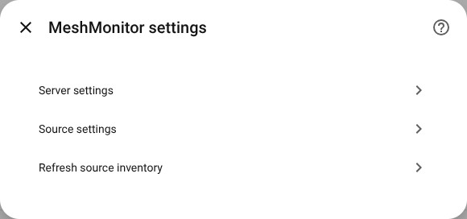
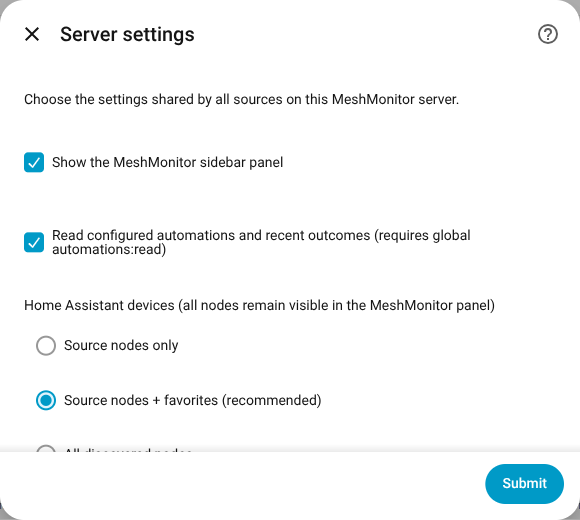

# MeshMonitor user guide

This guide covers the everyday parts of MeshMonitor for Home Assistant. For
installation and first-time setup, start with the [README](../README.md).

## Where to find MeshMonitor

After setup, **MeshMonitor** appears in the Home Assistant sidebar. If it does
not appear, open **Settings → Devices & services → MeshMonitor → Configure**
and make sure **Sidebar panel** is enabled.

Choose **Server settings** to show or hide the sidebar panel.

The panel combines every MeshMonitor server and source you have added to Home
Assistant. It refreshes automatically. The **Refresh** button updates the page
from information Home Assistant already has; it does not force the radios to
transmit or immediately poll MeshMonitor.

## Overview

Use **Overview** for a quick health check.

At the top you will see:

- total known nodes;
- nodes heard recently;
- how many nodes have a position; and
- which mesh protocols are represented.

Each source card shows connection state, last update, node and position counts,
and available firmware or radio details. A source is shown as needing attention
when it is disconnected, has stopped updating, or returned incomplete data.

If an older successful update is still available after a temporary error, the
panel says that it is showing older information instead of making the source
look healthy.

## Messages

Use **Messages** to read channel and direct-message history across the sources
you have allowed the API user to see.

You can:

- search by sender, node ID, channel, or message text;
- filter by protocol and source;
- pin or mute conversations in the current browser;
- mark conversations as read; and
- send a message when outbound messages are enabled.

Pins, mutes, filters, and read markers stay in that browser. They do not change
MeshMonitor and do not follow you to another computer or phone.

### If conversations are missing

Check both of these:

1. **Message polling** is enabled for the source under the integration's
   **Configure** screen.
2. The MeshMonitor API user has `messages:read` for the source and channel.

The first successful update records the current message list without firing
events for old messages. Only messages received afterward can trigger a new
`meshmonitor_message_received` event.

### Send a message

Sending is hidden until all required safeguards are enabled:

1. The Home Assistant user must be an administrator.
2. **Outbound messages** must be enabled for the source.
3. The MeshMonitor API user must have `messages:write`.
4. MeshCore also requires its transmit setting to be enabled in MeshMonitor.

Choose the destination, type the message, review it, and send. If the result is
unclear because of a timeout, check the conversation before trying again. The
integration does not automatically resend an uncertain transmission.

## Nodes

Use **Nodes** to search and sort all visible Meshtastic and MeshCore nodes.
Reticulum destinations are shown where the server supplies them, but they do
not pretend to have Meshtastic-style radio fields.

The table can show:

- last heard;
- battery or voltage;
- SNR and RSSI;
- channel use and transmit airtime;
- hop count;
- favorite state; and
- current position availability.

A dash means MeshMonitor did not provide that value. It does not mean zero.

Select a node to open its detail drawer. Depending on the protocol and your
permissions, the drawer can show current telemetry, link quality, recent
history, favorite controls, and a link to the matching source in MeshMonitor.

### Choose which nodes become Home Assistant devices

The **Home Assistant node devices** option controls the Devices & services
registry, not the MeshMonitor panel:

- **Source nodes only** keeps only the radios directly monitored by each
  source.
- **Source nodes + favorites** is the default and adds remote favorites.
- **All discovered nodes** creates devices for every visible node.

Changing this setting never removes a node from MeshMonitor. Home Assistant
shows a preview before it cleans up devices that no longer match the choice.

### Favorite a node

Favorite changes require **Server-persistent favorites** and `nodes:write`.
Meshtastic favorite changes are saved in MeshMonitor without writing them back
to the radio.

## Map

Use **Map** to see current node positions and stored network relationships.

### Choose a map style

- **Standard** uses normal OpenStreetMap tiles.
- **Neutral Dark** shows the same map with a darker appearance.
- **Tiles off / privacy** shows markers and links without requesting map tiles.

Standard and Neutral Dark contact the tile provider from your browser and can
reveal the approximate map area being viewed.

### Map controls

Use the filters to show one protocol, source, freshness range, favorite state,
or only positioned nodes. Clear the filters if a node you expect is missing.

Stored topology and neighbor links appear when MeshMonitor has saved them and
both ends have usable positions. Turning a layer on does not transmit over the
radio.

### Review a node's position history

Select a visible Meshtastic node and choose a time range from 1 hour to 7 days.
The trail is loaded only when you ask for it. Playback and the time slider run
in the browser.

An empty trail can simply mean that MeshMonitor has no saved positions in that
period. Private positions may also require `nodes_private:read`.

## Home Assistant devices and entities

Each MeshMonitor server and source becomes a Home Assistant device. Nodes can
also become devices according to the option described above.

Only values actually reported by MeshMonitor become entities. A node may have
a battery sensor but no voltage sensor, or a position but no signal value. If a
value disappears during a failed update, its existing entity becomes
unavailable instead of keeping an old healthy value.

GPS trackers are created only for nodes with a valid current position and only
when **GPS trackers** is enabled for that source. Tracker updates use normal
Home Assistant history and retention settings.

## Automations

MeshMonitor can provide Home Assistant events, device triggers, and actions.
The repository also includes blueprints for common examples.

Useful events include:

- `meshmonitor_message_received` for a newly received message;
- `meshmonitor_source_connection_changed` when a source explicitly changes
  between connected and disconnected; and
- automation outcome events when optional MeshMonitor automation monitoring is
  enabled.

Message text is left out of events unless **Expose message text in events** is
enabled. This helps prevent message bodies from being copied into automation
traces, notifications, and logs.

See [automation examples](AUTOMATION_EXAMPLES.md) for complete event fields and
blueprint instructions.

## Common tasks

### Check the mesh at a glance

1. Open **Overview**.
2. Look for a source marked disconnected, unavailable, or out of date.
3. Select the source card for more detail or open MeshMonitor for radio and
   server administration.

### Find a quiet or weak node

1. Open **Nodes**.
2. Search by name or ID.
3. Sort by **Last heard**, **SNR**, or **RSSI**.
4. Open the node drawer for additional telemetry and history.

### Find a node on the map

1. Open **Map**.
2. Clear any filters that may hide the node.
3. Search for the node or select it from the node list.
4. Choose **Neutral Dark** when you want the clearest dark-background view.

### Change the MeshMonitor address or token

Open **Settings → Devices & services → MeshMonitor** and choose
**Reconfigure**. Home Assistant checks the new connection before saving it.

### Add a newly visible source

Open the integration's menu and choose **Refresh source inventory**. Review the
sources found and confirm the update. A temporarily missing source is not
silently deleted.

## When something looks wrong

Start with these checks:

1. Open **Overview** and note the source status and last update.
2. Check the MeshMonitor source itself.
3. Review the integration's **Configure** screen for the affected feature.
4. Confirm the API user's source, channel, and permission access.
5. Check **Settings → System → Logs** for a MeshMonitor error.

Do not repeatedly reload the integration while diagnosing a connection
problem. Wait for one normal polling interval first. See the
[troubleshooting guide](TROUBLESHOOTING.md) for symptom-by-symptom help.
